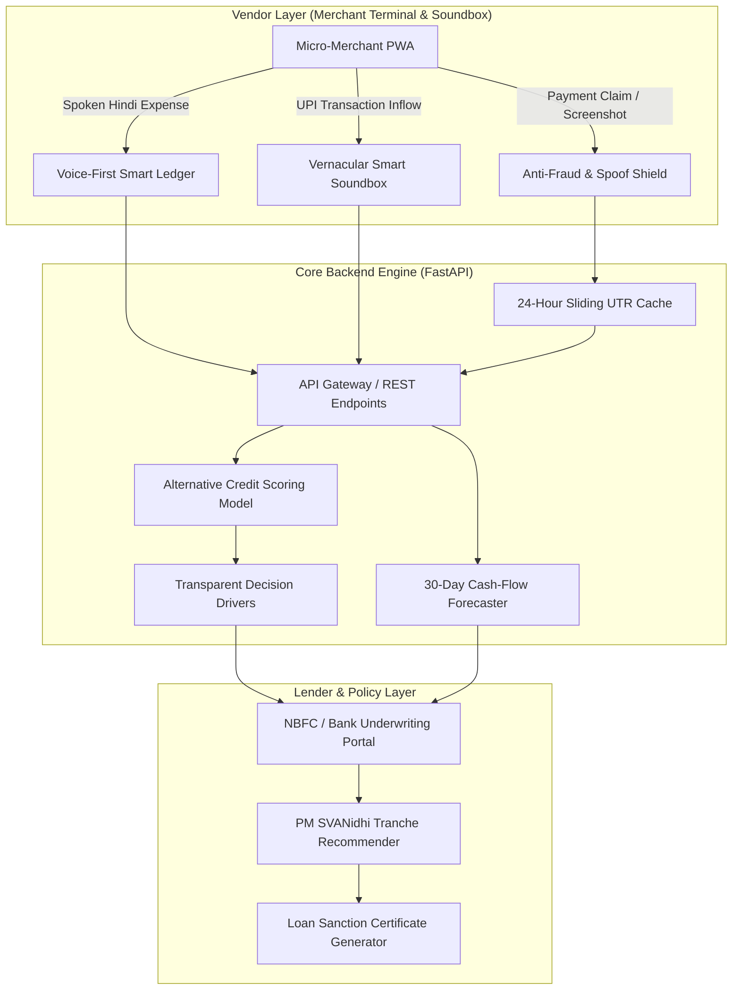

# MicroSetu (जन-सेतु)
### Alternative Credit Underwriting & Smart Vernacular POS for Informal Micro-Merchants

[](https://www.python.org/)
[](https://fastapi.tiangolo.com/)
[](https://scikit-learn.org/)
[]()
[]()

> **MicroSetu** is an applied FinTech platform and system prototype designed to solve the digital credit barrier for informal workers in India. By converting high-frequency UPI transaction streams into verifiable cash-flow footprints, MicroSetu enables institutional micro-lending under schemes like **PM SVANidhi (₹10,000 to ₹50,000)** without requiring formal credit bureau (CIBIL) scores or physical collateral.

---

## The Problem: The Unbanked Cash-Flow Paradox

India's informal sector employs over 90% of the country's workforce and generates roughly half of national GDP. Since the rollout of the Unified Payments Interface (UPI), millions of roadside chai stalls, vegetable vendors, and small merchants conduct daily business digitally via QR codes.

However, when these vendors apply for small business loans, traditional banks and NBFCs reject them because:
1. **Zero Credit Bureau Footprint:** Traditional underwriting relies on CIBIL/FICO scores, salary slips, and income tax returns (ITRs)—none of which informal vendors possess.
2. **Operational Illiteracy:** Bookkeeping apps and banking portals require typed English inputs, making them inaccessible to semi-literate merchants.
3. **Street-Level Payment Scams:** Vendors frequently fall victim to spoofed payment apps (fake Paytm/PhonePe APKs that display false confirmation screens without moving money).
4. **Rigid Monthly EMIs:** Informal daily income fluctuates; large lump-sum monthly loan installments often trigger defaults and distress.

**MicroSetu provides a full-stack technical solution to each of these challenges.**

---

## System Architecture



---

## Core Technical Modules

### 1. Alternative Cash-Flow Underwriting (`credit_model.py`)
* **How it works:** Evaluates 13 high-frequency behavioral cash-flow signals extracted from UPI merchant streams instead of bureau scores:
  * **Operational Consistency:** Active trading days per month (out of 30).
  * **Turnover Velocity & Stability:** Daily transaction count and coefficient of variation ($CV = \sigma / \mu$).
  * **Customer Retention:** Proportion of repeat UPI handles transacting regularly.
  * **Digital Hygiene:** Soundbox adoption (reducing dispute friction) and dispute failure rates.
* **The Output:** Computes a normalized **SetuScore (300 to 900)** with clear positive/negative risk drivers to ensure auditability and regulatory transparency.

### 2. Vernacular Voice-First Ledger (`voice_processor.py`)
* **How it works:** Uses the native browser **Web Speech API** for zero-latency speech-to-text in Hindi and Hinglish.
* **Extraction Pipeline:** A deterministic natural language regex slot-filling engine extracts the transaction type (`EXPENSE` vs `INCOME`), exact rupee amounts, and business categories (*e.g., Inventory, Mandi Wholesale, Utilities, Logistics*).
* **Vendor Benefit:** Merchants simply tap a microphone and say: *"Aaj 450 rupaye ki sabzi kharidi"* to instantly maintain double-entry bookkeeping records.

### 3. Anti-Fraud & Payment Spoof Prevention Shield (`fraud_detector.py`)
* **NPCI UTR Validation:** Verifies the 12-digit numeric reference against Indian banking switch routing conventions.
* **Sliding Window Replay Defense:** An in-memory 24-hour cache detects and blocks duplicate UTR numbers being shown by multiple customers.
* **Timestamp Freshness:** Flags screenshots with future-dated timestamps (fake APK generators) or stale receipts (>2 hours old).
* **Audio Soundbox Synchronization:** Only releases voice confirmation audio after a claim passes automated security heuristics.

### 4. Predictive Cash Flow & Daily Repayment Capping (`cashflow_forecaster.py`)
* **Probabilistic Projections:** Models 30-day forward cash flow incorporating day-of-week trends and liquidity fluctuations.
* **Micro-Deduction Debt Cap:** Recommends capping daily micro-repayments at **10%–12% of projected daily revenue**, protecting vendors from default during slow business weeks.

### 5. Automated PM SVANidhi Micro-Lending Portal (`server.py`)
* Automatically maps underwriting results into official Ministry of Housing and Urban Affairs (MoHUA) loan tranches:
  * **Tranche 1 (₹10,000):** Entry-level working capital for newly onboarded merchants.
  * **Tranche 2 (₹20,000):** Scale-up capital for merchants with 6+ months of consistent UPI velocity.
  * **Tranche 3 (₹50,000):** Enterprise expansion limit for established prime vendors.
* Generates authenticated digital **Loan Sanction Certificates** with daily sweep amounts and subsidized interest calculations.

---

## Quickstart Guide

### Prerequisites
* Python 3.9+ (Python 3.11 recommended)
* Any modern web browser (Chrome, Edge, Firefox, Safari)

### Installation & Launch

1. **Navigate to the project directory:**
   ```bash
   cd microsetu
   ```

2. **Install Python dependencies:**
   ```bash
   pip install fastapi uvicorn scikit-learn pandas numpy joblib
   ```

3. **Launch the application:**
   ```bash
   python start.py
   ```
   * The server initializes the calibrated dataset, loads the ML model, starts the FastAPI server on `http://127.0.0.1:8000`, and opens your default web browser automatically.

4. **Run automated test suite:**
   ```bash
   pytest tests/test_api.py -v
   ```

---

## 2-Minute Demo Walkthrough

1. **Merchant Terminal (Tab 1):**
   * Select a pre-loaded vendor persona (*e.g., Ramesh Kumar - Tea Stall* vs *Vikram - Auto Driver*).
   * Test the **Soundbox** by triggering a simulated payment to hear the instant multilingual voice confirmation.
   * Test the **Voice Ledger** by speaking an expense in Hindi/Hinglish to see the real-time P&L table update.
2. **SetuScore & Underwriting (Tab 2):**
   * Inspect the vendor's 300–900 credit score, risk tier, approved PM SVANidhi limit, and transparent positive/negative credit drivers.
   * Click **"Generate Sanction Certificate"** to inspect the official MoHUA loan certificate.
3. **Anti-Fraud Shield (Tab 3):**
   * Test a genuine 12-digit UTR vs a duplicate or spoofed UTR to see the defense heuristics in action.
4. **Cash Flow AI (Tab 4):**
   * View the 30-day forecast chart and daily micro-deduction debt cap calculations.

---

## Empirical Grounding & Research Context

MicroSetu was built as the technical companion to research on *UPI and its Impact on Financial Inclusion and Livelihoods of Informal Workers*.

The system parameters and merchant cohorts are calibrated to published empirical literature and central bank indicators:
* **RBI Financial Inclusion Index (FI-Index):** Reflects India's composite score growth from 53.9 (2021) to 70.0 (March 2026).
* **Informal Income Differential:** Calibrated against the findings of *Mallick & Singla (2025)* showing digital users average ₹15,800/mo vs ₹11,300/mo for cash-only peers (+39.8%).
* **Small-Ticket Profiling:** Conforms to NPCI retail statistics where 86% of person-to-merchant (P2M) transactions are $\le$ ₹500.
* **Field Survey Grounding:** Incorporates behavioral insights from *Attarwala (2025)* and *Devi (2025)* regarding vendor dispute anxiety and soundbox reliance.

---

## Project Structure

```
microsetu/
├── backend/
│   ├── server.py              # FastAPI application, REST endpoints & static serving
│   ├── credit_model.py        # Alternative underwriting model & feature attribution
│   ├── fraud_detector.py      # Anti-fraud UTR validation & replay defense
│   ├── cashflow_forecaster.py # Time-series cash-flow & micro-repayment model
│   ├── dataset_generator.py   # Calibrated merchant cohort & transaction generator
│   └── voice_processor.py     # Vernacular Hindi/Hinglish NLP ledger parser
├── frontend/
│   ├── index.html             # Single-page application dashboard layout
│   ├── style.css              # Custom CSS design system (glassmorphism tokens)
│   └── app.js                 # UI controllers, soundbox synthesis & chart rendering
├── docs/
│   ├── RESUME_BULLETS.md      # Grounded, senior-level resume bullet points
│   └── INTERVIEW_TALKING_POINTS.md # System design & interview preparation guide
├── tests/
│   └── test_api.py            # Automated unit and integration test suite
├── data/                      # Calibrated datasets and trained model artifacts
├── start.py                   # Python entry point & browser auto-launcher
├── run_demo.bat               # One-click Windows runner
└── README.md                  # Comprehensive documentation
```

---

## Tech Stack

| Layer | Technologies |
|---|---|
| **Backend & APIs** | Python 3.11, FastAPI, Uvicorn, Pydantic |
| **Machine Learning** | Scikit-Learn (Gradient Boosting), Pandas, NumPy, Joblib |
| **Frontend & UI** | Vanilla HTML5, Modern CSS Design Tokens, JavaScript (ES6+) |
| **Data Visualizations** | Chart.js, Lucide Icons, HTML5 Canvas QR Engine |
| **Audio & Speech** | Native Web Speech API (`speechSynthesis`, `webkitSpeechRecognition`) |

---

## License
Released under the **MIT License**.
